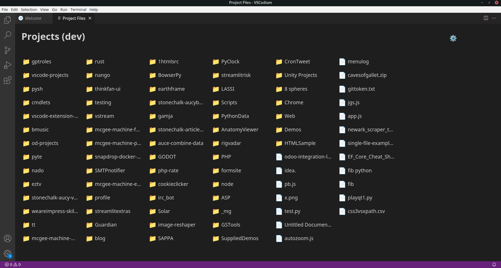

## Vscode Projects Overview

Simple projects overview for vscode. It will open with a new window that doesnt have a workspace or folder.

You set a projects folder that contains your projects, and the view will list all subfolders and files by recency.

Click on one of the project subfolders to open it in the current workspace, or click on a file to open it.

Projects view can also be opened with the `ctrl+f1` or `ctrl+alt+r` keyboard shorcuts, or using `>FS: Show projects view` in the command palette.